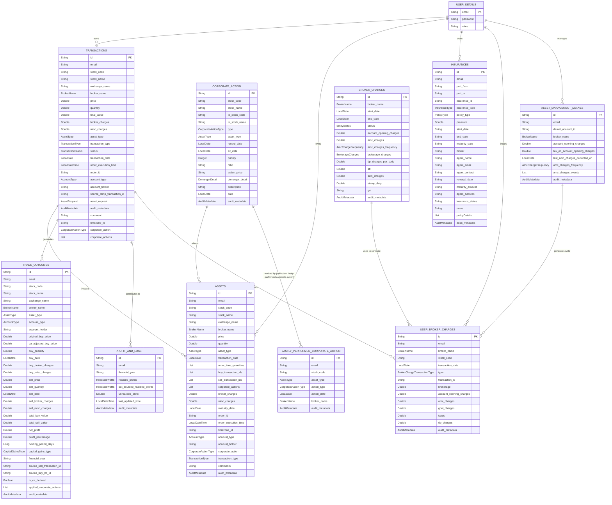

# WealthLens

A Spring Boot + Spring Modulith portfolio tracking application for the Indian stock market that manages buy/sell transactions, corporate actions (bonus, demerger, stock split), profit & loss calculation, broker & AMC charge tracking, and portfolio holdings using MongoDB for flexible document storage.

## Architecture Overview

WealthLens is built as a **single-deployable JAR Spring Modulith** application. The codebase is organized into explicit application modules under `com.thiru.wealthlens`, each with a `package-info.java` declaring allowed dependencies. Module boundaries are enforced via `ApplicationModules.verify()`.

### Layered Architecture (within each module)

```
Controller Layer   → REST API endpoints (no business logic)
Service Layer      → @Transactional business logic
Repository Layer   → Spring Data MongoDB
```

### Application Modules

| Module | Purpose | Key Types |
|--------|---------|-----------|
| **portfolio** | Core portfolio engine: transactions, P&L, trade matching, asset management, analytics, Excel export, temporary transaction redrive | PortfolioService, TransactionService, ProfitAndLossService, AssetEntity, TransactionEntity, AssetRequest |
| **corporate** | Corporate action processing: bonus, demerger, stock split, name/symbol change | CorporateActionService, CorporateActionEntity, CorporateActionType, LastlyPerformedCorporateAction |
| **brokercharges** | Broker & AMC charge computation, user-specific broker charge configuration | BrokerChargeService, UserBrokerChargeService, BrokerCharges, UserBrokerCharges |
| **auth** | JWT-based Spring Security: login, registration, role upgrades | AuthService, AuthFilter, SecurityConfig, UserDetail |
| **shared** | Cross-cutting utilities, common DTOs, audit entities, config, query helpers | ApiResponse, ErrorResponse, UserMail, TCollectionUtil, ExcelBuilder, XirrCalculator, MongoConfig |
| **helper** | Auxiliary controllers and file utilities | HelperController, SpecialController, TemplateController, TestController, FileHelper, FileStream, FileType |
| **finance** | Financial calculators (Step-up SIP) | FinancesService, StepUpSIPCalculator, FinanceRequest, FinanceResponse |
| **insurance** | Insurance policy tracking | InsuranceService, InsuranceEntity, PolicyDetails, InsuranceRequest, InsuranceResponse |
| **taxplanning** | Tax-planning domain (stub for future features) | TaxPlanningModulePlaceholder |

### Module Dependency Rules

- `portfolio` sits at the center and may depend on `shared`, `auth`, `corporate`, `brokercharges`, and `helper`.
- `brokercharges` and `corporate` are secondary domains that both depend on `portfolio` for holding context.
- `shared` contains cross-cutting utilities and depends on `portfolio` for domain-specific DTOs/entities consumed by generic tools (e.g. `MongoConfig` for custom conversions, `MongoDBConfig` for auditing).
- `auth` is the security layer and depends only on `shared`.
- `insurance`, `finance`, and `taxplanning` are leaf modules with no downstream consumers.
- All modules are declared **OPEN** (`@ApplicationModule(type = Type.OPEN)`) so internal sub-package types are exposed during the migration from a flat package layout.

### Key Packages (legacy flat layout → modules)

- `controller/` → REST API endpoints now split across `portfolio.controller`, `corporate.controller`, `brokercharges.controller`, `auth.controller`, `finance.controller`, `helper.controller`
- `service/` → Business logic now split across `portfolio.service`, `corporate.service`, `brokercharges.service`, `auth.service`, `finance.service`, `insurance.service`, `helper.service`
- `repository/` → Data access now split across `portfolio.repository`, `corporate.repository`, `brokercharges.repository`, `auth.repository`, `insurance.repository`
- `entity/` → MongoDB document entities now split across module `entity/` sub-packages
- `dto/` → DTOs now split across module `dto/` sub-packages with `shared.dto` holding common types
- `config/` → Configuration classes moved to `shared.config` (MongoDB, MongoDB auditing, transactions) and `auth.config` (security)
- `util/` → Static utility classes moved to `shared.util`
- `exception/` → Custom exceptions and global handler moved to `shared.exception`
- `auth/` → JWT authentication module (`auth.controller`, `auth.service`, `auth.filter`, `auth.config`, `auth.dto`, `auth.entity`, `auth.repository`)

## Data Model



## Tech Stack

| Layer | Technology |
|---|---|
| **Language** | Java 25 |
| **Framework** | Spring Boot 4.0.0 |
| **Web** | Spring Web MVC |
| **Security** | Spring Security + JWT (jjwt 0.13.0) |
| **Database** | MongoDB (Spring Data MongoDB) |
| **Transactions** | MongoDB multi-document transactions (requires replica set) |
| **Build** | Maven (multi-module: `backend`, `test-report`) |
| **Utilities** | Lombok, Apache POI 5.5.1 (Excel), Flying Saucer 10.0.6 + iTextPDF 5.5.13.4 (PDF), Thymeleaf |
| **Modulith** | Spring Modulith 2.1.0 (module boundary enforcement) |
| **Testing** | JUnit 5, Mockito, REST Assured 5.5.7, Testcontainers MongoDB 2.0.5, Spring Modulith Test |
| **Container** | Docker (multi-stage build) |
| **Nullability** | JSpecify 1.0.0 |

## Design Decisions

### FIFO-like Sell Allocation

SELL transactions iterate over `AssetEntity` purchase lots in ascending transaction date order, deducting quantities from the oldest lots first. This ensures accurate cost basis tracking per lot and correct short-term vs long-term capital gains classification.

### Temporary Transaction Pattern

When a `FILTERABLE_CORPORATE_ACTION` (BONUS, DEMERGER, STOCK_SPLIT) blocks a new transaction, the transaction is saved with `status = TEMPORARY` and its original `AssetRequest` is stored in the `assetRequest` field. Redrive via `POST /temporary-transactions/user/{email}/redrive` re-processes them once the corporate action is handled.

### Broker Charge Templates

`BrokerCharges` stores per-broker charge configurations with a validity window (`startDate`–`endDate`). Each template defines brokerage percentage/fixed/minimum/maximum charges, government levies (STT, SEBI, stamp duty), DP charges per scrip, AMC rates, and a GST applicability description (e.g. `18%-brokerage,18%-dp_charges,18%-stt`).

On each BUY/SELL transaction, `UserBrokerChargeService` looks up the active template for the transaction's broker and date, then computes:
- **Brokerage:** using a MIN or MAX aggregator across percentage-based and fixed charges
- **Government Charges:** STT + SEBI (+ stamp duty for BUY only)
- **DP Charges:** applied only on the first SELL per stock per day
- **Taxes (GST):** parsed from the template's GST description and applied component-wise

### AMC (Account Maintenance Charge) Imposition

`AssetManagementDetails` tracks per-user-per-broker demat account configuration, including account opening charges and AMC frequency (quarterly or annually). An administrative endpoint (`POST /broker-charges/amc/impose`) processes all overdue accounts and creates `UserBrokerCharges` entries for the computed AMC amount.

### Parallel P&L Reporting Hierarchy

The `ProfitAndLossEntity` now contains two independent report hierarchies:
1. **Capital Gains:** `RealisedProfits` → `FinancialReport` → `MonthlyReport` → `FortnightReport` (tracks purchase/sell amounts, profit)
2. **Broker Charges:** `RealisedProfits` → `YearlyBrokerCharges` → `MonthlyBrokerCharges` → `BrokerChargesReport` (tracks brokerage, government charges, taxes, DP charges, AMC)

This separation allows independent analysis of trading costs versus trading profits.

### Portfolio Transaction v2

`addTransactionV2` introduces a refined buy/sell flow:
- **BUY (v2):** Each buy creates a separate `AssetEntity` (no same-day lot merging). For EQUITY assets, broker charges are automatically recorded in the P&L.
- **SELL (v2):** Uses `findEligibleHoldingsForSell(email, stockCode, brokerName, accountHolder, transactionDate)` to fetch all buy lots with `transactionDate ≤ sellDate`, ordered ascending (FIFO). Each consumed buy lot contributes its own cost basis to the P&L calculation.

### Corporate Action Processing

Corporate actions are processed per financial quarter (Jan–Mar, Apr–Jun, Jul–Sep, Oct–Dec). `LastlyPerformedCorporateAction` tracks the last processed action per user/stock/asset-type/action-type/broker to prevent duplicate processing and determine blocking status.

### Global Response Wrapping

`ResponseWrapperAdvice` automatically wraps all JSON responses in `ApiResponse<T>` (disabled in the `integration-test` profile). This provides a consistent response envelope across the API.

### MongoDB Document Conventions

Collections and field names use `snake_case` (e.g., `@Document(value = "transactions")`, `@Field("stock_code")`). Enums are stored as strings. All entities embed `AuditMetadata` via the `AuditableEntity` interface.

### Stateless JWT Authentication

`AuthFilter` (a `OncePerRequestFilter`) validates JWT tokens before the standard `UsernamePasswordAuthenticationFilter`. Sessions are stateless. Tokens expire in 30 minutes and are signed with HmacSHA256.

### Excel Import/Export Pipeline

Custom `AbstractExcelWorkbookProcessor` / `AbstractExcelWorkbookWriter` hierarchy handles portfolio and transaction exports. Upload templates and bulk transaction imports are supported via Apache POI.

## How to Run Locally

### 1. Prerequisites

- Java 25
- Maven 3.9+
- MongoDB (local or Atlas with replica set for transactions)

### 2. Build

```bash
./mvnw clean install -pl backend -am -DskipTests
```

### 3. Run

```bash
./mvnw spring-boot:run -pl backend
```

The application starts on `http://localhost:8080`

### 4. Run Tests

```bash
./mvnw test -pl backend
# Specific test class:
./mvnw test -pl backend -Dtest=PortfolioServiceTest
```

### 5. Docker

```bash
docker build -t wealthlens .
docker run -p 8080:8080 -e SPRING_PROFILES_ACTIVE=prod wealthlens
```

## API Usage Examples

### Register

```bash
curl -X POST http://localhost:8080/auth/register \
  -H "Content-Type: application/json" \
  -d '{
    "email": "user@example.com",
    "password": "password123",
    "roles": "USER"
  }'
```

### Login

```bash
curl -X POST http://localhost:8080/auth/login \
  -H "Content-Type: application/json" \
  -d '{
    "email": "user@example.com",
    "password": "password123"
  }'
```

### Add Transaction

```bash
curl -X POST "http://localhost:8080/portfolio/user/user@example.com/transaction" \
  -H "Content-Type: application/json" \
  -H "Authorization: Bearer <token>" \
  -d '{
    "stockCode": "INFY",
    "stockName": "Infosys Limited",
    "exchangeName": "NSE",
    "brokerName": "ZERODHA",
    "price": 1450.00,
    "quantity": 10,
    "assetType": "EQUITY",
    "transactionType": "BUY",
    "transactionDate": "2024-01-15",
    "accountType": "DEMAT",
    "accountHolder": "user@example.com"
  }'
```

### Upload Transactions (Excel)

```bash
curl -X POST "http://localhost:8080/portfolio/user/user@example.com/upload-transactions?quarter=Q1" \
  -H "Authorization: Bearer <token>" \
  -F "file=@transactions.xlsx"
```

### Get Portfolio

```bash
curl -X GET "http://localhost:8080/portfolio/user/user@example.com/stocks/all" \
  -H "Authorization: Bearer <token>"
```

### Get Profit & Loss

```bash
curl -X GET "http://localhost:8080/portfolio/user/user@example.com/profit-and-loss?financialYear=2024-25" \
  -H "Authorization: Bearer <token>"
```

### Add Corporate Action

```bash
curl -X POST http://localhost:8080/corporate-action/add \
  -H "Content-Type: application/json" \
  -H "Authorization: Bearer <token>" \
  -d '{
    "stockCode": "INFY",
    "stockName": "Infosys Limited",
    "type": "BONUS",
    "assetType": "EQUITY",
    "recordDate": "2024-06-15",
    "exDate": "2024-06-14",
    "priority": 1,
    "ratio": "1:1"
  }'
```

### Perform Corporate Actions for User

```bash
curl -X PUT "http://localhost:8080/corporate-action/user/user@example.com/perform?allBrokers=false" \
  -H "Authorization: Bearer <token>"
```

### Redrive Temporary Transactions

```bash
curl -X POST "http://localhost:8080/temporary-transactions/user/user@example.com/redrive" \
  -H "Authorization: Bearer <token>"
```

### Get All Transactions (with filters)

```bash
curl -X POST "http://localhost:8080/transactions/user/user@example.com" \
  -H "Content-Type: application/json" \
  -H "Authorization: Bearer <token>" \
  -d '{
    "queryFilter": {
      "filters": [
        {"key": "stockCode", "operator": "EQUALS", "value": "INFY"}
      ]
    },
    "dateRange": {
      "startDate": "2024-01-01",
      "endDate": "2024-12-31"
    }
  }'
```

### Financial Calculator (EMI)

```bash
curl -X POST http://localhost:8080/finances/calculate \
  -H "Content-Type: application/json" \
  -H "Authorization: Bearer <token>" \
  -d '{
    "calculationType": "EMI",
    "principal": 1000000,
    "interestRate": 8.5,
    "tenureInMonths": 240
  }'
```

### Download Portfolio Excel

```bash
curl -X GET "http://localhost:8080/portfolio/user/user@example.com/assets/holding/LONG_TERM/excel" \
  -H "Authorization: Bearer <token>" \
  --output long_term_holdings.xlsx
```

### Add Broker Charge Template

```bash
curl -X POST http://localhost:8080/broker-charges/add \
  -H "Content-Type: application/json" \
  -H "Authorization: Bearer <token>" \
  -d '{
    "brokerName": "ZERODHA",
    "startDate": "2024-01-01",
    "status": "ACTIVE",
    "accountOpeningCharges": 0,
    "amcChargesAnnually": 300,
    "amcChargesFrequency": "QUARTERLY",
    "brokerageCharges": {
      "brokerage": 0,
      "brokerageCharges": 20,
      "brokerageAggregator": "MIN",
      "minimumBrokerage": 0,
      "maximumBrokerage": 20
    },
    "dpChargesPerScrip": 13.5,
    "stt": 0.1,
    "sebiCharges": 0.0001,
    "stampDuty": 0.015,
    "gstApplicableDescription": "18%-brokerage,18%-dp_charges,18%-stt,18%-amc_charges"
  }'
```

### Get Broker Charge Template

```bash
curl -X GET "http://localhost:8080/broker-charges/{id}" \
  -H "Authorization: Bearer <token>"
```

### Add Asset Management Detail

```bash
curl -X POST "http://localhost:8080/broker-charges/user/user@example.com/add/asset-management-detail" \
  -H "Content-Type: application/json" \
  -H "Authorization: Bearer <token>" \
  -d '{
    "brokerName": "ZERODHA",
    "dematAccountId": "1234567890",
    "accountOpeningCharges": 300,
    "taxOnAccountOpeningCharges": 54,
    "lastAmcChargesDeductedOn": "2024-01-01",
    "amcChargesFrequency": "QUARTERLY"
  }'
```

### Get Asset Management Details

```bash
curl -X GET "http://localhost:8080/broker-charges/user/user@example.com/asset-management-details" \
  -H "Authorization: Bearer <token>"
```

### Impose AMC Charges

```bash
curl -X POST "http://localhost:8080/broker-charges/amc/impose" \
  -H "Authorization: Bearer <token>"
```

### Get User Broker Charges

```bash
curl -X GET "http://localhost:8080/user-broker-charges/user/user@example.com/all" \
  -H "Authorization: Bearer <token>"
```

### Add Transaction (v2)

```bash
curl -X POST "http://localhost:8080/portfolio/user/user@example.com/transaction/v2" \
  -H "Content-Type: application/json" \
  -H "Authorization: Bearer <token>" \
  -d '{
    "stockCode": "INFY",
    "stockName": "Infosys Limited",
    "exchangeName": "NSE",
    "brokerName": "ZERODHA",
    "price": 1450.00,
    "quantity": 10,
    "assetType": "EQUITY",
    "transactionType": "BUY",
    "transactionDate": "2024-01-15",
    "accountType": "SELF",
    "accountHolder": "user@example.com"
  }'
```

## Assumptions

- **MongoDB Replica Set:** Multi-document transactions require a MongoDB replica set. The `app.mongodb.transactions-enabled` flag must be `true`.
- **User Email as Identifier:** The `email` path variable serves as the user identifier across all portfolio endpoints. Authentication extracts the user from JWT but the API still accepts email explicitly in paths. ⚠️ **Security gap:** Controllers currently do not validate that the path `email` matches the authenticated JWT principal. Path variable email is used directly without authorization checks.
- **Indian Market Context:** Asset types, exchange names, and broker names are oriented toward Indian stock market conventions.
- **Holding Period:** Long-term vs short-term classification is based on a 1-year holding period (≥366 days) for **all asset types** uniformly, not just equities.
- **Broker Charge Template Required:** For automatic broker charge calculation on BUY/SELL transactions, an active `BrokerCharges` template must exist for the broker and transaction date. If missing, the transaction proceeds without broker charges.
- **GST Description Format:** The `gstApplicableDescription` field in `BrokerChargesRequest` follows the format `XX%-component_name,XX%-component_name` (e.g. `18%-brokerage,18%-stt`). The percentage symbol is optional; components not matching known names are silently ignored.
- **DP Charge Deduplication:** DP charges are applied only once per stock per day on SELL transactions. Multiple sells of the same stock on the same day incur DP charges only on the first sell.
- **AMC Frequency:** Quarterly AMC uses a fixed 91-day interval (not strict calendar quarters). Annual AMC uses a 1-year interval.
- **Quarterly Corporate Actions:** Corporate actions are batched and processed per financial quarter rather than individually per record date.

## Future Improvements

### Completed
- **XIRR Calculation:** Already implemented. Newton-Raphson algorithm with bisection fallback is available via `AnalyticsController` at `/analytics/user/{email}/xirr`.

### In Progress / Partially Implemented
- **Insurance Module:** Data model (`InsuranceEntity`, `PolicyDetails`, DTOs) exists but service layer is an empty stub and no controller endpoints are exposed.
- **Advanced Analytics:** Portfolio performance metrics (win/loss ratio, avg profit/loss, best/worst stock, turnover) and asset allocation by type are already available via `AnalyticsController`. Missing: sector allocation (no sector field in entities), benchmark comparison, and charting endpoints.
- **Broker Charge Analytics:** Transaction-level broker charges are fully captured in `UserBrokerCharges` and the P&L entity has a `YearlyBrokerCharges` → `MonthlyBrokerCharges` → `BrokerChargesReport` hierarchy. Missing: aggregation endpoints, dashboard views, and financial year grouping queries.

### Not Started
- **Frontend Application:** Build a React/Angular web UI for portfolio visualization and transaction entry.
- **Real-time Market Data:** Integrate with a market data provider (NSE/BSE APIs) for live stock prices and unrealised P&L.
- **Notifications:** Add email/push notifications for corporate action alerts and portfolio updates.
- **Caching:** Introduce Redis caching for frequently accessed portfolio and transaction data.
- **Multi-currency Support:** Extend support for international stocks with currency conversion.
- **Event-Driven Architecture:** RabbitMQ configuration exists (`shared.config.RabbitMQConfig`) but is currently commented out with no AMQP dependency in the build. When activated, it can publish domain events (transaction created, corporate action performed) for downstream consumers.
