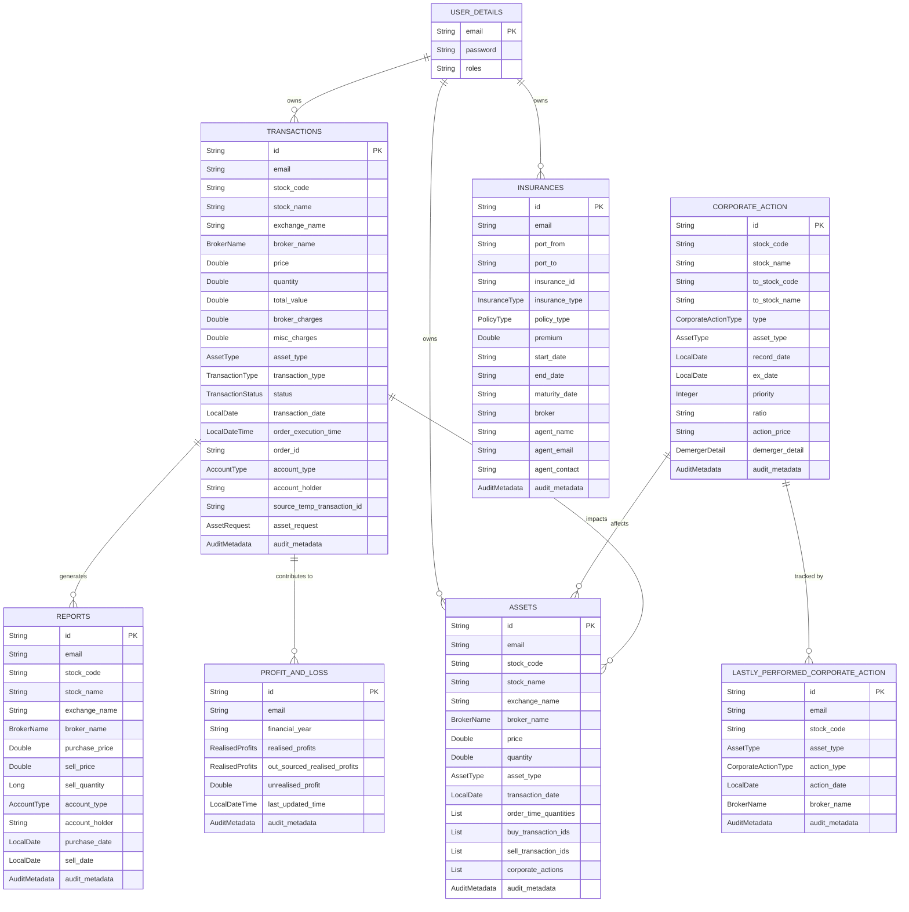

# Investment Tracker

A Spring Boot-based portfolio tracking application for the Indian stock market that manages buy/sell transactions, corporate actions (bonus, demerger, stock split), profit & loss calculation, and portfolio holdings using MongoDB for flexible document storage.

## Architecture Overview

The service follows a 3-layer architecture:

```
Controller Layer          → PortfolioController, TransactionController, CorporateActionController,
                            UserCorporateActionController, TemporaryTransactionsController,
                            ReportController, FinancesController, AuthController,
                            EntityExportController, TemplateController, HelperController
         ↓
Service Layer             → PortfolioService, TransactionService, CorporateActionService,
                            TemporaryTransactionService, ProfitAndLossService, ReportService,
                            FinancesService, AuthService, EntityExportService
         ↓
Repository / Document     → MongoDB Repositories (Spring Data MongoDB)
```

**Key Packages:**
- `controller/` — REST API endpoints
- `service/` — Business logic and transaction processing
- `repository/` — Data access (Spring Data MongoDB)
- `entity/` — MongoDB document entities with snake_case field names
- `dto/` — Data transfer objects with `asTransaction()` / `asAsset()` converters
- `dto/enums/` — Domain enums (TransactionType, AssetType, CorporateActionType, etc.)
- `dto/context/` — Processing context objects (AssetContext, DemergerContext, ProfitAndLossContext)
- `auth/` — JWT authentication (controller, service, filter, config)
- `config/` — MongoDB config, converters, transaction config, RabbitMQ config
- `util/` — Static utility classes (`TCollectionUtil`, `TJsonMapper`, `TLocalDate`, Excel builders/parsers)
- `exception/` — Custom exceptions and global exception handler (`ControllerAdviser`)

## Data Model



## Tech Stack

| Layer | Technology |
|---|---|
| **Language** | Java 25 |
| **Framework** | Spring Boot 4.0.0 |
| **Web** | Spring Web MVC |
| **Security** | Spring Security + JWT (jjwt 0.13.0) |
| **Database** | MongoDB (Spring Data MongoDB) |
| **Transactions** | MongoDB multi-document transactions (requires replica set) |
| **Build** | Maven (multi-module: `backend`, `test-report`) |
| **Utilities** | Lombok, Apache POI 5.5.1 (Excel), Flying Saucer 10.0.6 + iTextPDF 5.5.13.4 (PDF), Thymeleaf |
| **Testing** | JUnit 5, Mockito, REST Assured 5.5.7, Testcontainers MongoDB 2.0.5 |
| **Container** | Docker (multi-stage build) |

## Design Decisions

### FIFO-like Sell Allocation

SELL transactions iterate over `AssetEntity` purchase lots in ascending transaction date order, deducting quantities from the oldest lots first. This ensures accurate cost basis tracking per lot and correct short-term vs long-term capital gains classification.

### Temporary Transaction Pattern

When a `FILTERABLE_CORPORATE_ACTION` (BONUS, DEMERGER, STOCK_SPLIT) blocks a new transaction, the transaction is saved with `status = TEMPORARY` and its original `AssetRequest` is stored in the `assetRequest` field. Redrive via `POST /temporary-transactions/user/{email}/redrive` re-processes them once the corporate action is handled.

### Corporate Action Processing

Corporate actions are processed per financial quarter (Jan–Mar, Apr–Jun, Jul–Sep, Oct–Dec). `LastlyPerformedCorporateAction` tracks the last processed action per user/stock/asset-type/action-type/broker to prevent duplicate processing and determine blocking status.

### Global Response Wrapping

`ResponseWrapperAdvice` automatically wraps all JSON responses in `ApiResponse<T>` (disabled in the `integration-test` profile). This provides a consistent response envelope across the API.

### MongoDB Document Conventions

Collections and field names use `snake_case` (e.g., `@Document(value = "transactions")`, `@Field("stock_code")`). Enums are stored as strings. All entities embed `AuditMetadata` via the `AuditableEntity` interface.

### Stateless JWT Authentication

`AuthFilter` (a `OncePerRequestFilter`) validates JWT tokens before the standard `UsernamePasswordAuthenticationFilter`. Sessions are stateless. Tokens expire in 30 minutes and are signed with HmacSHA256.

### Excel Import/Export Pipeline

Custom `AbstractExcelWorkbookProcessor` / `AbstractExcelWorkbookWriter` hierarchy handles portfolio and transaction exports. Upload templates and bulk transaction imports are supported via Apache POI.

## How to Run Locally

### 1. Prerequisites

- Java 25
- Maven 3.9+
- MongoDB (local or Atlas with replica set for transactions)

### 2. Build

```bash
./mvnw clean install -pl backend -am -DskipTests
```

### 3. Run

```bash
./mvnw spring-boot:run -pl backend
```

The application starts on `http://localhost:8080`

### 4. Run Tests

```bash
./mvnw test -pl backend
# Specific test class:
./mvnw test -pl backend -Dtest=PortfolioServiceTest
```

### 5. Docker

```bash
docker build -t investment-tracker .
docker run -p 8080:8080 -e SPRING_PROFILES_ACTIVE=prod investment-tracker
```

## API Usage Examples

### Register

```bash
curl -X POST http://localhost:8080/auth/register \
  -H "Content-Type: application/json" \
  -d '{
    "email": "user@example.com",
    "password": "password123",
    "roles": "USER"
  }'
```

### Login

```bash
curl -X POST http://localhost:8080/auth/login \
  -H "Content-Type: application/json" \
  -d '{
    "email": "user@example.com",
    "password": "password123"
  }'
```

### Add Transaction

```bash
curl -X POST "http://localhost:8080/portfolio/user/user@example.com/transaction" \
  -H "Content-Type: application/json" \
  -H "Authorization: Bearer <token>" \
  -d '{
    "stockCode": "INFY",
    "stockName": "Infosys Limited",
    "exchangeName": "NSE",
    "brokerName": "ZERODHA",
    "price": 1450.00,
    "quantity": 10,
    "assetType": "EQUITY",
    "transactionType": "BUY",
    "transactionDate": "2024-01-15",
    "accountType": "DEMAT",
    "accountHolder": "user@example.com"
  }'
```

### Upload Transactions (Excel)

```bash
curl -X POST "http://localhost:8080/portfolio/user/user@example.com/upload-transactions?quarter=Q1" \
  -H "Authorization: Bearer <token>" \
  -F "file=@transactions.xlsx"
```

### Get Portfolio

```bash
curl -X GET "http://localhost:8080/portfolio/user/user@example.com/stocks/all" \
  -H "Authorization: Bearer <token>"
```

### Get Profit & Loss

```bash
curl -X GET "http://localhost:8080/portfolio/user/user@example.com/profit-and-loss?financialYear=2024-25" \
  -H "Authorization: Bearer <token>"
```

### Add Corporate Action

```bash
curl -X POST http://localhost:8080/corporate-action/add \
  -H "Content-Type: application/json" \
  -H "Authorization: Bearer <token>" \
  -d '{
    "stockCode": "INFY",
    "stockName": "Infosys Limited",
    "type": "BONUS",
    "assetType": "EQUITY",
    "recordDate": "2024-06-15",
    "exDate": "2024-06-14",
    "priority": 1,
    "ratio": "1:1"
  }'
```

### Perform Corporate Actions for User

```bash
curl -X PUT "http://localhost:8080/corporate-action/user/user@example.com/perform?allBrokers=false" \
  -H "Authorization: Bearer <token>"
```

### Redrive Temporary Transactions

```bash
curl -X POST "http://localhost:8080/temporary-transactions/user/user@example.com/redrive" \
  -H "Authorization: Bearer <token>"
```

### Get All Transactions (with filters)

```bash
curl -X POST "http://localhost:8080/transactions/user/user@example.com" \
  -H "Content-Type: application/json" \
  -H "Authorization: Bearer <token>" \
  -d '{
    "queryFilter": {
      "filters": [
        {"key": "stockCode", "operator": "EQUALS", "value": "INFY"}
      ]
    },
    "dateRange": {
      "startDate": "2024-01-01",
      "endDate": "2024-12-31"
    }
  }'
```

### Financial Calculator (EMI)

```bash
curl -X POST http://localhost:8080/finances/calculate \
  -H "Content-Type: application/json" \
  -H "Authorization: Bearer <token>" \
  -d '{
    "calculationType": "EMI",
    "principal": 1000000,
    "interestRate": 8.5,
    "tenureInMonths": 240
  }'
```

### Download Portfolio Excel

```bash
curl -X GET "http://localhost:8080/portfolio/user/user@example.com/assets/holding/LONG_TERM/excel" \
  -H "Authorization: Bearer <token>" \
  --output long_term_holdings.xlsx
```

## Assumptions

- **MongoDB Replica Set:** Multi-document transactions require a MongoDB replica set. The `app.mongodb.transactions-enabled` flag must be `true`.
- **User Email as Identifier:** The `email` path variable serves as the user identifier across all portfolio endpoints. Authentication extracts the user from JWT but the API still accepts email explicitly in paths.
- **Indian Market Context:** Asset types, exchange names, and broker names are oriented toward Indian stock market conventions.
- **Holding Period:** Long-term vs short-term classification is based on a 1-year holding period for equities.
- **Quarterly Corporate Actions:** Corporate actions are batched and processed per financial quarter rather than individually per record date.

## Future Improvements

- **Frontend Application:** Build a React/Angular web UI for portfolio visualization and transaction entry.
- **Real-time Market Data:** Integrate with a market data provider (NSE/BSE APIs) for live stock prices and unrealised P&L.
- **Insurance Module:** Complete the `InsuranceService` to support full CRUD for insurance policies.
- **Notifications:** Add email/push notifications for corporate action alerts and portfolio updates.
- **Caching:** Introduce Redis caching for frequently accessed portfolio and transaction data.
- **Multi-currency Support:** Extend support for international stocks with currency conversion.
- **Advanced Analytics:** Add portfolio performance metrics, XIRR calculation, and sector/asset allocation charts.
- **Event-Driven Architecture:** Leverage RabbitMQ config to publish domain events (transaction created, corporate action performed) for downstream consumers.
